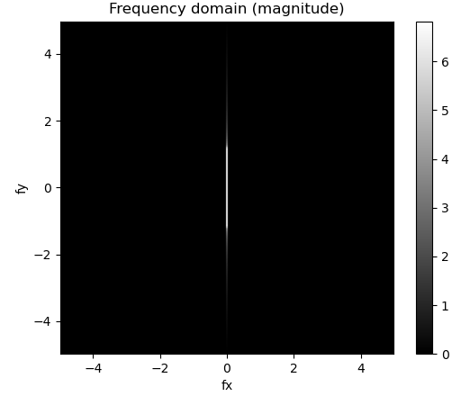
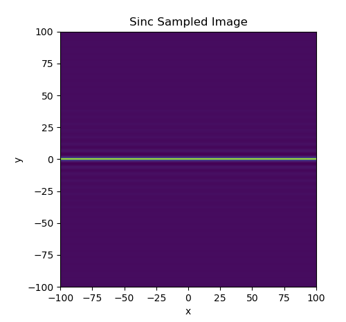
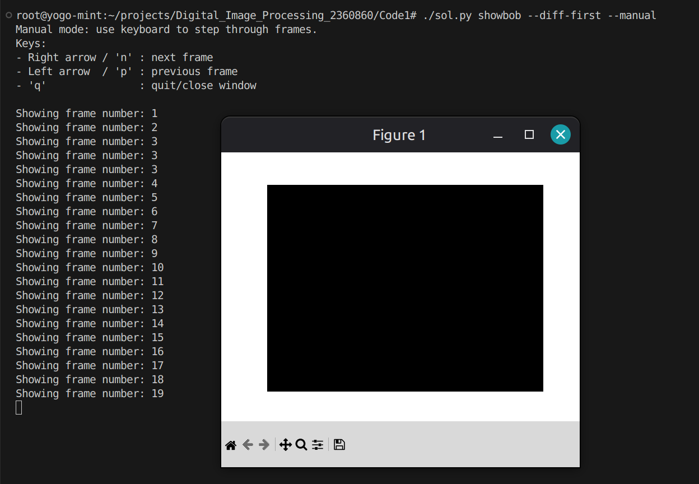
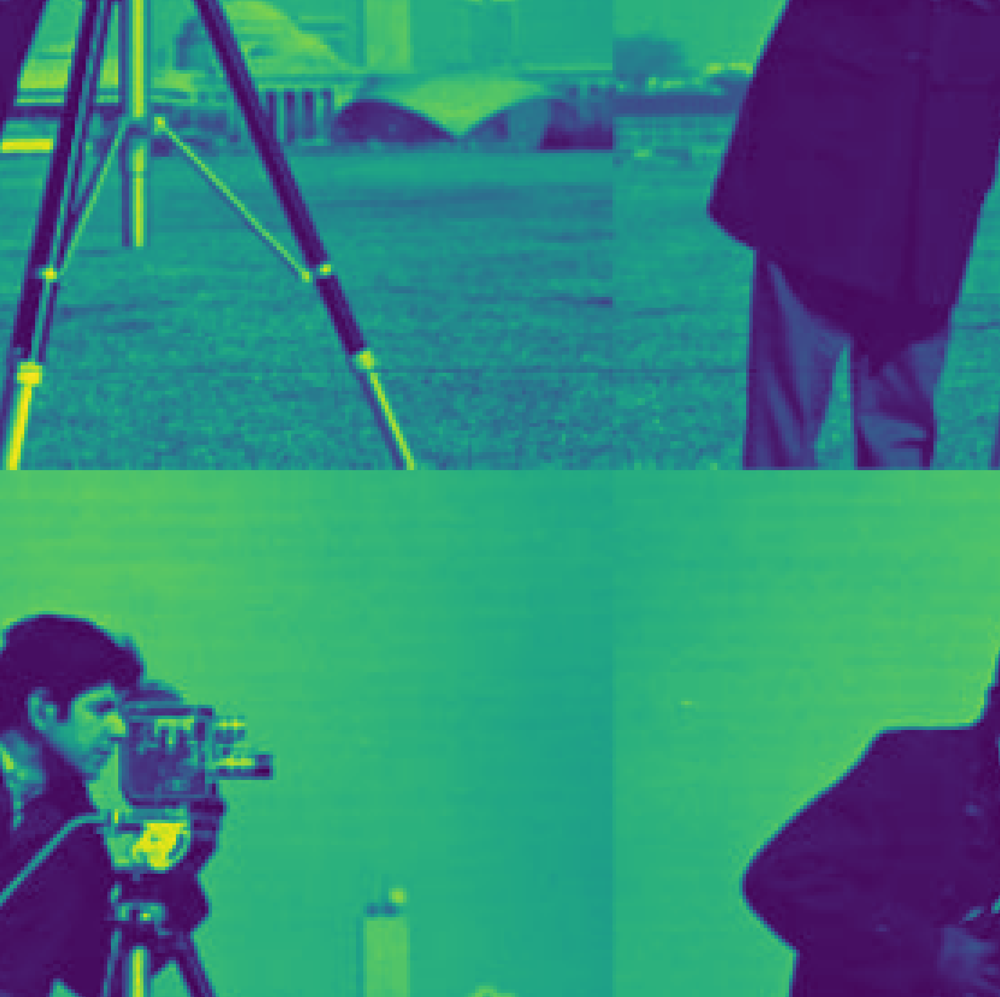
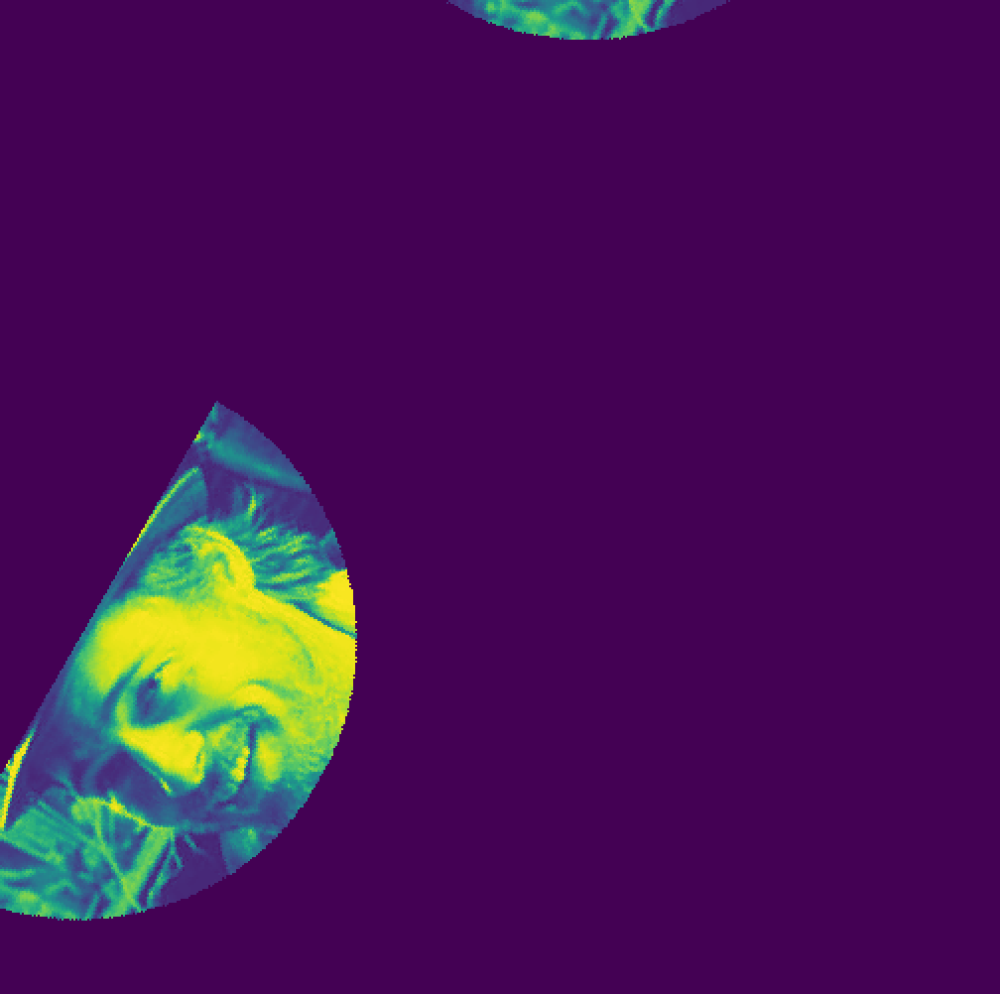
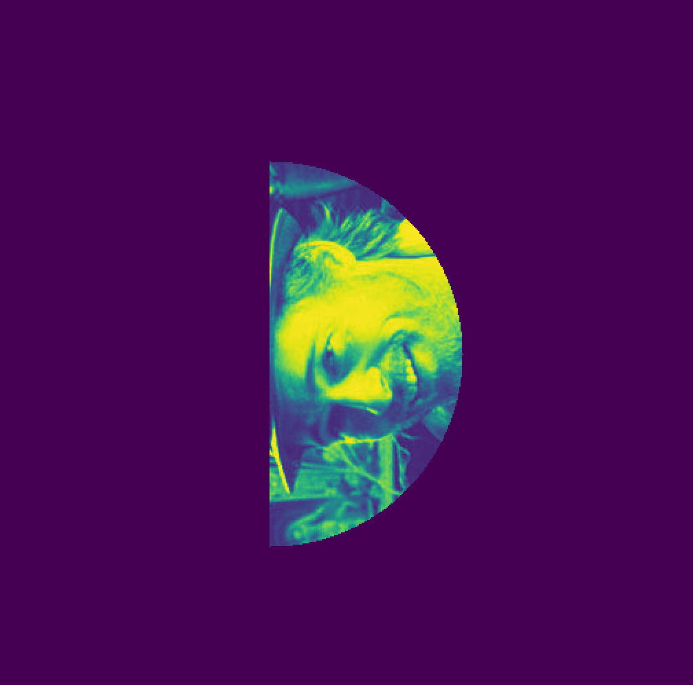
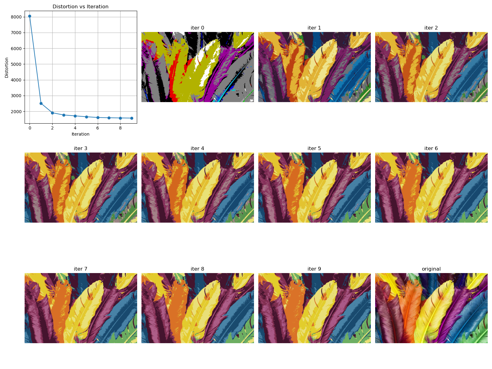

The solution to the whole exercise is given in the `sol.py` file.
The parts of the exercise are seperated and are in-order.

The file works as a single script, that can be run different modes for each question in the exercise.

# Question 1 - First Part
## Q1, Part a
We implement sampling the image as specified within the `SincAnalysis` class.


## Q1, Part b
If we run:
```bash
./sol.py q1_b
```
We see:


We can see that the function is constant in the x axis, which matches the fact that our function's value does not depend on x.
We can see that the frequency in the y axis around the middle is something like 1.1, which is very close to what we would expect which is (where $C_y$ is what is multipled by $y$ inside $sin$):
$$
f_y =\frac{C_y}{2\pi} = \frac{\pi\frac{50}{21}}{2\pi} = \frac{25}{21} \approx 1.19
$$
And this falls well within the margin of error my bad visual estimation.

## Q1, Part c
If we run:
```bash
./sol.py q1_c
```
We see:



This really matches what we expect: the bounds on the x frequency are almost 0 since it's just a constant, while the y frequencies are more spread out, while still being concentrated bellow 1.5.

## Q1, Part d
If we run:
```bash
./sol.py q1_d
```
We see:




Interestingly, this time the frequencies are segnificantly lower than the real ones - it looks like a frequency of about 0.2.
This is ofcourse aliasing which happens since our sampling frequency is too low now.

## Q1, Part e
Yes. If we want to correctly sample the waves of the `sinc` function we will have to have a sufficient sampling frequency, which was clearly demonstrated in part d.

Theoretically, we would want our frequency to at-least match the nyquist bound:

$$
f \geq f_{nyquist} = 2\cdot f_{max} \approx 2\cdot 1.19 = 2.38
$$

Essentially, we want our y-axis sampling frequncy to be at-least $2.38$ while a sampling frequency of 0 or something really small should be fine for the x axis.

This matches the bounding box of the frequency domain images from earlier.

# Question 1 - Second Part
## Q1, Part f
Running:
```bash
./sol.py q1_f
```
Will display an animation.
Here is a screenshot from it:


It's spongbob running in circles around his burning house.


### Q1, Part g
This was more tricky than I expected. Here is what I did:
* First - diff the first frame from all frames and normalize the result: this makes it easy to tell which frame is identical to the first frame (when we see all back).
* Additionally, I added a feature for manually iterating through the fragmes with the arrowkeys so I can go through them one-by-one.

This can be run with:
```bash
./sol.py q1_g
```

So now I advance slowly through the frames...


And when I display frame at index 19 I see:



So indices strictly included in a single cycle are `[0, 18]` including edges - which is 19 different indices.

So there are $19 [Frames / Cycle]$, if every frame was displayed for one second - spongebob would be cycling at $1/19 [Hz]$.


## Q1, Part h
We would have to sample at least $2/19 [Samples / Frame]$.
More explicitly, if we set:
* $F = \frac{1}{19} [Cycle / Frame]$
* $N = n [Frame / Second]$

We can find:
$$
    f_{max}=F*N = \frac{n}{19} \left[\frac{Cycle}{Frame} \cdot \frac{Frame}{Second}\right] = \frac{n}{19} [Hz]
$$
$$
\Rightarrow f_{nyquist} = 2*f_{max} = \frac{2n}{19} [Hz]
$$


## Q1, Part i
Remember the different frames are `[0, 18]`, so the image indices are equivalent (modulu) `%19`. Since `18%19 = (-1)%19`, sampling every 18 frames is the same as sampling the previous frame in terms of the sequence of frames that is shown.

I have added a variable `sampling_ratio` - which dictates 'every how many frames is the shown image updated?', so with `sampling_ratio=2` the image updates every 2 frames e.t.c.

If I run:
```bash
./sol.py q1_i
```
bob runs backwards.

If we were to run this with the default display interval of 20, he would run very slowly.

This is becaues while the sequence if images is identical to going back one frame in each cycle - each frame is now displayed 18 times longer.

So when we run `q1_i`, the display interval is instead set to 2.

In terms of frequency - this means cycling backwards is achived by a sampling frequency of:
$$
\frac{1}{18}\left[\frac{Samples}{Frame}\right]
= \frac{1}{18}\left[\frac{Samples}{\frac{Cycle}{19}}\right]
= \frac{19}{18}\left[\frac{Samples}{Cycle}\right]
$$

# Question 2

## Q2, Part a
This function was implemented as `interpolate_shift_dimension_fractional`.

## Q2, Part b
This function was implemented as `interpolate_shift_dimension`.

## Q2, Part c
If we run:
```bash
./sol.py q2_c
```
We see:



We have also added a mode where we can play with the shift interactively by click and dragging with the mouse.
This can be done by running:
```bash
./sol.py q2_interactive
```

Which will show something like:


## Q2, Part d
If we run:
```bash
./sol.py q2_d
```
We see:


## Q2, Part e
If we run:
```bash
./sol.py q2_e
```
We see:


## Q2, Part f
If we run:
```bash
./sol.py q2_f
```
We see:





It looks like the edges in the rotated images are very 'sharp' - the image lost it's smoothness in this process.

## Q2, Part g
If we run:
```bash
./sol.py q2_g
```
We will see the interpolated and non-interpolated images side-by-side for each angle:


This yielded a significant improvement in the issue we described before - but not for the 90 degrees case - since it did not have much of an issue to begin with.
We think that the interplolated versions are better in the cases where it matters.

It should not matter in the case of all right angles - 0, 90, 180, 270, since there is no interpolation to be done in these cases - the pixels fall 'right in place' of others.

# Question 3
## Q3, Part d:
We can run the algorithm with the specified initial vectors with:
```bash
./3.py quantize-steps instructions/colorful.tif max_lloyed_iv.json
```
And see the following results:


And if we let it randomize the same amount of initial vectors (9) with:
```bash
./3.py quantize-steps instructions/colorful.tif 9
```
We see the following results:


So it looks like:
1. the initial distortion with our specified set of vectors is much higher.
2. after many iterations, they converge to very similar results (both visually and numerically).