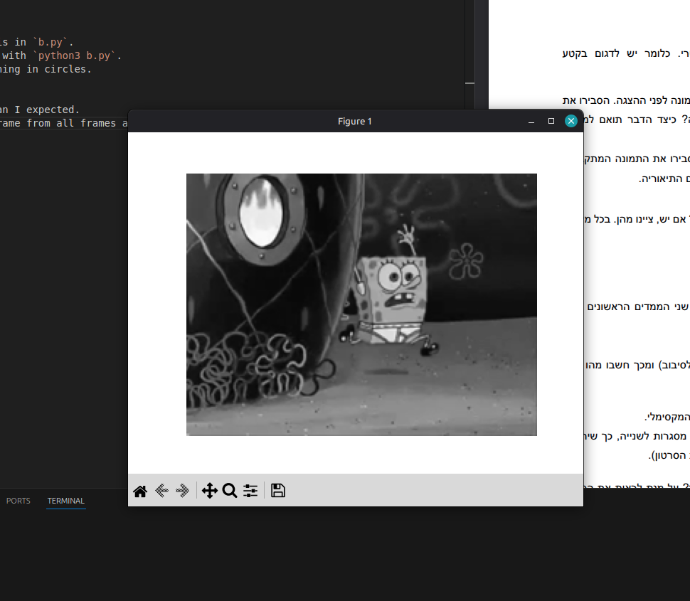
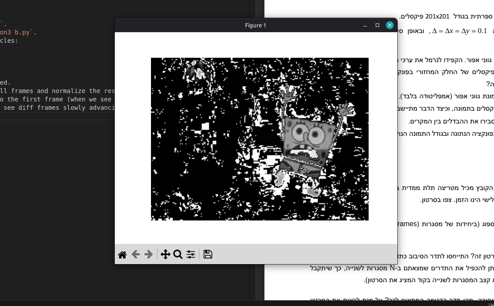
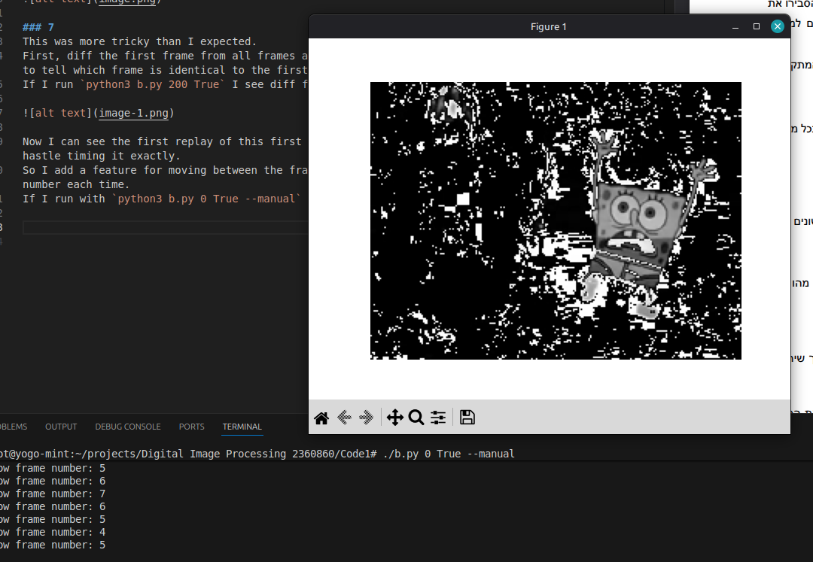
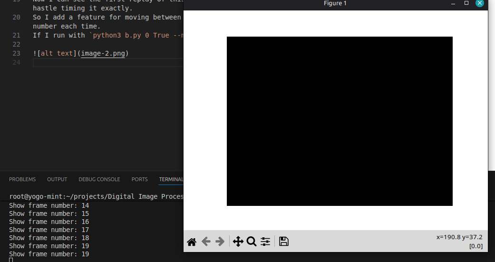

## Part a:

## Part b:
### 6
Placing the code for this in `b.py`.
I can run the animation with `python3 b.py`.
Looks like spongbob running in circles:

### 7
This was more tricky than I expected.
First, diff the first frame from all frames and normalize the result: this makes it easy to tell which frame is identical to the first frame (when we see all back).
If I run `python3 b.py 200 --diff-first` I see diff frames slowly advancing:

Now I can see the first replay of this first frame is around frame #20 but it's still a hastle timing it exactly.
So I add a feature for moving between the frames manually and print the next frame number each time.
If I run with `python3 b.py --diff-first --manual` I see:

Advancing to frame at index 19 shows:

So indices trictly included in a single cycle are `[0, 18]` including edges - which is 19 different indices.

So there are $19 [Frames / Cycle]$, if every frame was displayed for one second - spongebob would be cycling at $1/19 [Hz]$.

### 8
We would have to sample at least $2/19 [Samples / Frame]$.
More explicitly, if we set:
* $F = \frac{1}{19} [Cycle / Frame]$
* $N = n [Frame / Second]$

We can find:
$$
    f_{max}=F*N = \frac{n}{19} \left[\frac{Cycle}{Frame} \cdot \frac{Frame}{Second}\right] = \frac{n}{19} [Hz]
$$
$$
\Rightarrow f_{nyquist} = 2*f_{max} = \frac{2n}{19} [Hz]
$$

### 9
Remember the different frames are `[0, 18]`, so the image indices are equivalent (modulu) `%19`. Since `18%19 = (-1)%19`, sampling every 18 frames is the same as sampling the previous frame in terms of the sequence of frames that is shown.

I have added a variable `sampling_ratio` - which dictates 'every how many frames is the shown image updated?', so with `sampling_ratio=2` the image updates every 2 frames e.t.c.

If I run: `python3 b.py 36 18` bob runs backwards, but very slowly.
This is becaues while the sequence if images is identical to going back one frame in each cycle - each frame is now displayed 18 times longer.

To fix the animation speed, we can run: `python3 b.py 2 18`.

In terms of frequency - this means cycling backwards is achived by a sampling frequency of:
$$
\frac{1}{18}\left[\frac{Samples}{Frame}\right]
= \frac{1}{18}\left[\frac{Samples}{\frac{Cycle}{19}}\right]
= \frac{19}{18}\left[\frac{Samples}{Cycle}\right]
$$